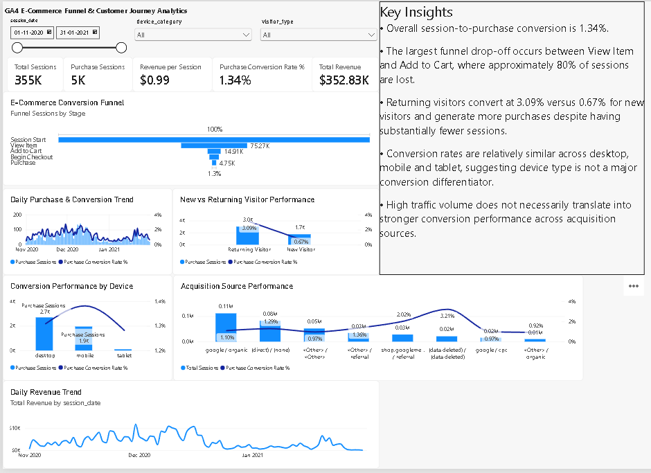

# GA4 E-Commerce Funnel & Customer Journey Analytics

**BigQuery SQL | GA4 | Funnel Analysis | Power BI | DAX | Digital Analytics**

## Project Overview

This portfolio project analyses Google Analytics 4 (GA4) e-commerce event data from the Google Merchandise Store to understand where users leave the purchase journey, how conversion differs across visitor and acquisition segments, and which products convert product interest most effectively.

The project demonstrates an end-to-end analytics workflow:

**GA4 event export → BigQuery SQL → nested field handling → session modelling → funnel analysis → segmentation → product analysis → Power BI dashboard → business interpretation**

## Business Problem

> Where does conversion weaken across the e-commerce journey, which customer and acquisition segments perform differently, and what evidence should decision-makers investigate further?

## Data Source

**Source:** Google Analytics BigQuery sample dataset  
**Property:** Google Merchandise Store  
**Dataset:** `bigquery-public-data.ga4_obfuscated_sample_ecommerce`  
**Analysis period:** 1 November 2020 to 31 January 2021  

The dataset is public and intentionally obfuscated. Findings are presented as portfolio analysis rather than production reporting for Google or the Google Merchandise Store.

## Dataset Profile

- **4,295,584** GA4 event records
- **270,154** distinct users (`user_pseudo_id`)
- **92** days of data
- **354,857** sessions in the Power BI analytical model

## Purchase Funnel

`Session Start → View Item → Add to Cart → Begin Checkout → Purchase`

| Funnel Stage | Sessions | Stage Conversion | Stage Drop-off | Overall Conversion |
|---|---:|---:|---:|---:|
| Session Start | 354,857 | — | — | 100.00% |
| View Item | 75,271 | 21.21% | 78.79% | 21.21% |
| Add to Cart | 14,909 | 19.81% | 80.19% | 4.20% |
| Begin Checkout | 10,853 | 72.79% | 27.21% | 3.06% |
| Purchase | 4,745 | 43.72% | 56.28% | 1.34% |

The largest shopping-stage leakage occurs between **View Item and Add to Cart**, where **80.19%** of sessions do not progress to an add-to-cart event. Checkout-to-purchase leakage is also substantial at **56.28%**. These patterns identify where measured progression weakens; they do not establish the causal reason for abandonment.

## Key Business Insights

### Returning visitors convert far more strongly

| Visitor Type | Sessions | Purchase Sessions | Conversion Rate |
|---|---:|---:|---:|
| New Visitor | 257,400 | 1,736 | 0.67% |
| Returning Visitor | 97,457 | 3,009 | 3.09% |

Returning-visitor sessions convert at **3.09% versus 0.67%** for new visitors and generate more purchase sessions despite substantially lower traffic volume.

### Device conversion is relatively consistent

| Device | Sessions | Purchase Sessions | Conversion Rate |
|---|---:|---:|---:|
| Desktop | 205,899 | 2,695 | 1.31% |
| Mobile | 141,079 | 1,949 | 1.38% |
| Tablet | 7,879 | 101 | 1.28% |

Mobile has the highest observed rate, but the differences are small. Device category should not be presented as a major conversion differentiator in this sample.

### Traffic volume does not automatically mean higher conversion

- `google / organic`: **111,488 sessions**, **1.10%** conversion
- `(direct) / (none)`: **82,362 sessions**, **1.29%** conversion
- `shop.googlemerchandisestore… / referral`: **28,044 sessions**, **2.02%** conversion
- `google / cpc`: **15,534 sessions**, **0.97%** conversion

Obfuscated values such as `<Other>` and `(data deleted)` are retained transparently but are not used for specific marketing recommendations.

### Product popularity and product conversion are different

- **Super G Unisex Joggers:** 227 purchase sessions, **1.24%** view-to-purchase rate
- **Google Camp Mug Ivory:** 181 purchase sessions, **5.68%** view-to-purchase rate
- **Google Clear Pen 4-Pack:** **4.78%** view-to-purchase rate
- **Google Campus Bike:** **4.74%** view-to-purchase rate

This separates products that win through traffic volume from products that convert product interest more efficiently.

## Power BI Dashboard



The final Power BI dashboard includes KPI cards, date/device/visitor slicers, an e-commerce funnel, purchase and conversion trends, visitor and device comparisons, first-user acquisition performance, daily revenue, and an executive Key Insights panel.

**Power BI file:** [`dashboard/GA4_Ecommerce_Funnel_Analytics.pbix`](dashboard/GA4_Ecommerce_Funnel_Analytics.pbix)

### Dashboard KPIs

- **Total Sessions:** 354,857
- **Purchase Sessions:** 4,745
- **Purchase Conversion Rate:** 1.34%
- **Total Revenue:** approximately **$352.83K**
- **Revenue per Session:** approximately **$0.99**

The dashboard revenue is scoped to the same session population used by the funnel: sessions with a non-null GA4 session ID and an observed `session_start` event.

## Skills Demonstrated

### BigQuery SQL
- Wildcard tables and `_TABLE_SUFFIX`
- `UNNEST()` for repeated GA4 fields
- Event-parameter extraction
- CTEs and conditional aggregation
- Window functions including `LAG()`
- Session-level modelling
- Funnel conversion and drop-off analysis
- Device and acquisition segmentation
- Product-level item analysis
- Revenue aggregation

### GA4 / Digital Analytics
- Event-based measurement
- Session and user behaviour
- E-commerce funnel design
- Conversion analysis
- First-user acquisition analysis
- New vs Returning Visitor segmentation
- Product performance interpretation

### Power BI
- Power Query
- Session-level data modelling
- DAX measures
- Funnel visualisation
- Combo charts and time-series analysis
- Interactive slicers
- KPI design
- Executive dashboard layout

## Methodology Notes

The main funnel is a **session-event-presence funnel**. A session is counted at a stage when that event appears within the session; the current portfolio model does **not** enforce strict chronological event ordering.

`traffic_source.source` and `traffic_source.medium` are treated as **first-user acquisition** attributes, not session-level traffic source.

A session containing `first_visit` is classified as **New Visitor**; sessions without it are classified as **Returning Visitor** for this portfolio analysis.

For full methodological detail and limitations, see [`docs/methodology_and_limitations.md`](docs/methodology_and_limitations.md).

## Data Handling

The raw GA4 event dataset is not duplicated in GitHub. It remains publicly accessible through BigQuery, and the repository includes the complete SQL workflow needed to reproduce the analysis. The final Power BI `.pbix` contains the session-level analytical model used by the dashboard.

## Repository Structure

```text
ga4-ecommerce-funnel-analytics/
├── README.md
├── .gitignore
├── data/
│   └── README.md
├── sql/
│   ├── 01_dataset_profile.sql
│   ├── 02_event_profile.sql
│   ├── 03_session_funnel.sql
│   ├── 04_funnel_conversion_metrics.sql
│   ├── 05_device_conversion.sql
│   ├── 06_acquisition_source_conversion.sql
│   ├── 07_new_vs_returning_conversion.sql
│   ├── 08_product_performance.sql
│   ├── 09_daily_trends.sql
│   └── 10_power_bi_export.sql
├── docs/
│   ├── project_plan.md
│   ├── data_dictionary.md
│   ├── validated_findings.md
│   └── methodology_and_limitations.md
├── dashboard/
│   ├── README.md
│   └── GA4_Ecommerce_Funnel_Analytics.pbix
└── images/
    ├── README.md
    └── ga4_ecommerce_dashboard.png
```

## Project Status

✅ **Complete — BigQuery analysis, validated funnel metrics and Power BI dashboard completed.**

## Author

**Antony Pereira George**  
Dublin, Ireland  
Data Analyst | SQL | Python | Power BI

---

*This project uses Google's public, obfuscated GA4 sample e-commerce dataset and is intended for educational and portfolio purposes.*